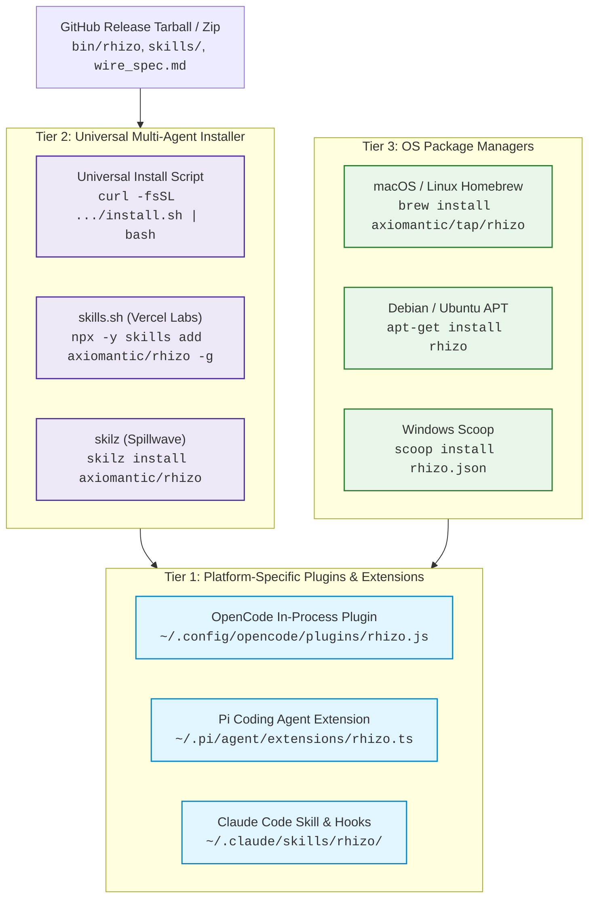

# Contributing to Rhizo

We welcome contributions to Rhizo! Whether you are optimizing Lua scripts, improving the native Nim binary, adding integrations for new coding assistants, or expanding test coverage, here is how to get started.

## Development Setup

### Tool Versions & Runtime Management

Rhizo tracks tool versions via `.tool-versions` (respected by [`mise`](https://mise.jdx.dev) and `asdf`).

We recommend using **mise** to guarantee exact compiler and interpreter alignment:

```bash
# 1. Install mise (if not already installed)
curl https://mise.run | sh

# 2. Install pinned tool versions (Nim 2.2.12 and Python 3.12)
mise install

# Verify your active versions
nim --version      # Nim Compiler Version 2.2.12
python3 --version   # Python 3.12.x
```

Alternatively, if you manage tools manually:
- **Nim**: Pinned to **2.2.12** (`choosenim 2.2.12`, or `brew install nim` on macOS, `sudo apt install nim` on Linux).
- **Python**: **3.10+** (Python 3.12 recommended for integration tests and Pydantic validation).
- **Redis Server**: **6.2+** or **Valkey 7.2+** (`brew install redis` on macOS, `sudo apt install redis-server` on Linux, or Docker).
- **OpenSSL**: **1.1+** / **3.0+** headers and dynamic libraries.

### Quick Build & Test

```bash
# 1. Clone repository
git clone https://github.com/axiomantic/rhizo.git
cd rhizo

# 2. Build native Nim binary (1 second)
nim c -d:release -o:bin/rhizo src/rhizo.nim
ln -sf rhizo bin/locutus 2>/dev/null || true

# 3. Set up Python virtual environment & dependencies
python3 -m venv .venv
source .venv/bin/activate  # On Windows: .venv\Scripts\activate
pip install --upgrade pip

# Option A: Editable install via pyproject.toml (recommended)
pip install -e .

# Option B: Install via requirements.txt
pip install -r requirements.txt

# 4. Start local Redis server
brew services start redis  # or: docker run -d -p 6379:6379 redis:alpine

# 5. Run full test suite
pytest
# Or using shared CI script:
./scripts/ci/test.sh
```

## Architectural Guidelines

1. **Zero Glue / Zero Background Daemons**:
   - Rhizo core must remain zero-dependency. Do not add long-running background Python/Node daemon processes. All coordination runs over Redis primitives and the native `rhizo` binary.

2. **Air-Gap Prompt Firewall**:
   - Never allow unverified or tampered data from Redis to reach assistant stdout. Signature verification must happen strictly before message deserialization.

3. **EVALSHA Caching**:
   - All Lua scripts in `scripts/` are embedded at compile-time into `src/rhizo.nim` and cached using Redis `EVALSHA` with automatic `EVAL` fallback.

## Continuous Integration & Dual-CI Architecture

Rhizo uses a dual-CI architecture with shared execution scripts:
- **Shared CI Scripts**: Build and test logic lives in `scripts/ci/` (`install-deps.sh`, `build.sh`, `test.sh`). These scripts can be run directly by developers locally from any terminal.
- **Forgejo Actions (`.forgejo/workflows/ci.yml`)**: Covers Linux builds and test suite matrices against multiple Nim versions on the self-hosted Linux (Podman-backed) runner.
- **GitHub Actions (`.github/workflows/ci.yml`)**: Preserves macOS (`macos-latest`) and Windows (`windows-latest`) platform verification legs where private runner capacity is not available, as well as release packaging.

## Pull Request Process

1. Fork the repo and create a topic branch from `main`.
2. Ensure all unit and integration tests pass: `./scripts/ci/test.sh` (or `pytest`).
3. If modifying `scripts/*.lua`, recompile `bin/rhizo` (`./scripts/ci/build.sh`).
4. Submit a Pull Request describing your changes, motivation, and test evidence.

---

## Coding Harness Architecture & Behavioral Models

Rhizo coordinates autonomous coding assistants across heterogeneous terminal, editor, and container environments. Because different coding harnesses (OpenCode, Claude Code, OpenAI Codex, Antigravity, Pi, Cursor, GitHub Copilot) expose vastly different extension points, lifecycle hooks, and process models, Rhizo adapts to each platform's native architecture.

### Supported Harnesses & Runtime Behaviors

#### 1. OpenCode
- **Integration Mechanism**: Native JavaScript/TypeScript plugin runtime (`skills/rhizo/opencode-ear.js`) loaded from `~/.config/opencode/plugins/rhizo.js` (or legacy `locutus.js`).
- **Lifecycle & Session Hooks**:
  - `shell.env`: Injects `RHIZO_SESSION_ID=opencode:<sessionId>` and `RHIZO_AGENT_NAME=<agent>` (with `LOCUTUS_*` aliases) into the shell environment before every bash tool execution. This guarantees that CLI subcommands executed inside OpenCode inherit identity without manual configuration.
  - `event`: Subscribes to `session.created` to provision an agent identity and arm an active listener; subscribes to `session.deleted` to clean up session mappings and unregister the agent.
- **Session Mapping**: Automatically persists `opencode:<sessionId>` mappings in `~/.config/rhizo/sessions.json` (fallback `~/.config/locutus/sessions.json`) and synchronizes with Redis hash `${PREFIX}sessions`.
- **Idle Wakeup & In-Flight Interruption**:
  - Runs an asynchronous generator over `rhizo listen <agent> 0` in an unblocked fiber.
  - **Idle State**: Injects incoming tasks directly into the agent's turn loop using `client.session.promptAsync({ path: { id: sessionId }, body: { parts: [{ type: "text", text }] } })`.
  - **Busy State & Immediate Urgency**: For messages tagged `--immediate`, the ear checks `client.session.status()`, triggers `client.session.abort({ path: { id: sessionId } })` to cancel long-running builds or commands, waits for the session to settle into `idle`, and immediately injects the urgent prompt.

##### 2. Claude Code
- **Integration Mechanism**: Skill definition (`SKILL.md`) in `~/.claude/skills/rhizo` + passive tool execution hook (`~/.claude/hooks/post-tool-execution`) + continuation `Stop` hook (`claude_stop_hook.py`).
- **Passive Hook Mode**: After any tool call (e.g., `Bash`, `FileEdit`), `post-tool-execution` executes `rhizo drain 50 <agent> --hook` to drain any queued backlog and return a formatted continuation prompt block into context.
- **Continuation Stop Hook**: When a turn completes, the `Stop` hook checks for pending messages and blocks exit to feed incoming tasks directly into the next turn.

#### 3. OpenAI Codex
- **Integration Mechanism**: Shell-level pre/post execution hooks and one-shot subagent listeners.
- **Runtime Behavior**: Uses `rhizo open <agent>` at session bootstrap to register identity and drain offline backlogs. For background listening, Codex spawns a one-shot subagent running `rhizo listen <agent>` or uses `codex_stop_hook.py`.

#### 4. Google Deepmind Antigravity (AGY)
- **Integration Mechanism**: Full skill installation in `~/.gemini/config/skills/rhizo` and native agentic loop integration.
- **Reactive Wakeups & Background Tasks**:
  - AGY features native reactive wakeups: commands launched via `run_command` run as asynchronous background tasks.
  - When an AGY task runner executes `rhizo listen <agent>` as a background daemon task (`IsDaemon=true`), the AGY runtime automatically awakens the assistant when a message arrives—eliminating busy polling loops.
  - In-flight urgency is handled via subagent task cancellation (`manage_task kill`) and re-dispatch.

#### 5. Pi Coding Agent (`pi.dev`)
- **Integration Mechanism**: Native TypeScript extension API (`~/.pi/agent/extensions/*.ts`) loaded via `jiti` without compilation, plus native skill in `~/.pi/agent/skills/rhizo`.
- **Extension Architecture**:
  - Pi exposes runtime events (`pi.on("tool_call")`, `pi.on("session_start")`) and tool registration (`pi.registerTool`).
  - An in-process extension streams `rhizo listen` and dispatches prompts into the active turn via `deliverPiPrompt` (`pi.sendMessage` / `pi.session.prompt`).
  - In-flight preemption for `--immediate` triggers `pi.abort()`.

#### 6. Cursor & GitHub Copilot
- **Integration Mechanism**: Terminal integration via embedded shell terminals, task runners, and skill configurations (`.cursor/rules/rhizo.mdc`, `.github/copilot-instructions.md`).
- **Runtime Behavior**: Terminal sessions running inside Cursor or VS Code utilize the standard CLI and native `rhizo listen --notify` desktop notifications to alert developers when an agent receives urgent coordination messages.

---

## Architecture: Direct CLI Execution vs External Protocols

Rhizo operates strictly as a zero-dependency CLI executable communicating directly with Redis. It avoids wrapping coordination in external protocol layers (such as MCP or custom background daemons) because:
1. **Direct Terminal & Shell Integration**: Modern AI coding assistants execute shell commands natively (`run_command`, `Task`, `bash`). A direct binary invocation provides zero-overhead execution without intermediate JSON-RPC layers.
2. **True Background Autonomy & In-Flight Preemption**: Standard protocol wrappers cannot wake idle sessions or preempt busy compute turns without host integration. Rhizo pairs native binary listeners directly with in-process extensions (`opencode-ear.js`, `pi-ear.ts`) and reactive background tasks.
*(For architectural background, see [ADR 0002: Daemonless Native CLI Architecture](docs/adr/0002-daemonless-cli-architecture.md).)*

---

## Developer Guide: Adding Support for a New Coding Harness

When adding support for a new coding harness, follow this 12-question evaluation and implementation checklist:

### 1. What hooks are required for the coding harness integration?
A complete integration requires up to three architectural tiers:
- **Identity / Environment Injection Hook**: Injects `RHIZO_AGENT_NAME` and `RHIZO_SESSION_ID` into the harness's bash/tool execution environment (e.g., OpenCode's `shell.env`).
- **Passive Post-Tool Drain Hook**: Drains queued inbox messages after tool executions when the agent is already in an active turn (e.g., Claude Code's `post-tool-execution` running `rhizo drain 50 <agent> --hook`).
- **Active Idle Wakeup / Extension**: Listens on Redis in the background and stimulates the harness when a message arrives while the agent is idle. Use **native in-process extensions** (e.g., OpenCode plugin `promptAsync`, Pi extension `deliverPiPrompt`), **continuation Stop hooks** (Claude, Codex, AGY), or **native desktop notifications** (`rhizo listen --notify` for Cursor/Copilot). *Never simulate keystrokes or inject characters into terminal multiplexers (e.g., `tmux send-keys`).*

### 2. How should the harness handle backgrounding behavior?
- The harness must **never** run a blocking wait on stdout during a foreground turn. Background listening must always be offloaded to a native in-process fiber/thread, an asynchronous reactive task (e.g., AGY `run_command(IsDaemon=true)`), or a one-shot subagent with no timeout.
- Background processes must register clean shutdown handlers (`SIGINT`, `SIGTERM`, process exit) to remove listener locks (`DEL ${PREFIX}listener:<name>`) and prevent zombie PID records.
- **Never allow the LLM to invent background scripts**: The harness instructions must provide strict, single-line commands. Forbid `while true; do rhizo listen; done` loops and `&` detachments, which silently discard output.

### 3. Can it interrupt while working?
Determine if the harness supports programmatic turn interruption:
- **Programmatic Abort (Tier 1)**: If the harness provides a session cancellation API (like OpenCode's `client.session.abort()` or Pi's `pi.abort()`), trigger abort on messages with urgency `--immediate`, wait for the session to transition from `busy` to `idle`, and inject the new prompt.
- **Hook Continuation (Tier 2)**: For CLI harnesses (Claude Code, Codex), lifecycle `Stop` hooks intercept turn completion and feed urgent messages directly into continuation turns.
- **Queued Delivery (Fallback)**: For messages with urgency `--soon`, never interrupt. Allow the in-flight turn or command to finish, and deliver the message on the subsequent turn.

### 4. What blocking issues should we anticipate?
- **TTY / stdin Clashing**: Never allow `rhizo listen` to attach to foreground stdin. Run with redirected stdin (`< /dev/null`) or in detached pipes.
- **Listener Lock Deadlocks**: If a harness crashes without running cleanup, its PID lock remains in Redis. Ensure your harness registers with `rhizo open`, which automatically clears stale locks if the recorded PID is dead on the local host.
- **Prompt Injection Risks**: Never format unauthenticated or raw external data directly into an LLM prompt. Always invoke `rhizo drain --hook` or verify HMAC signatures before presenting data to the agent.
- **Session Mapping Collisions**: Ensure session IDs are prefixed with the harness name (e.g., `opencode:<id>`, `pi:<id>`, `codex:<id>`) to prevent key collisions in shared Redis session registries.

### 5. How do we verify compatibility with existing systems?
- Run the Pydantic schema validation suite (`pytest tests/test_nim_binary.py`) to verify that all message envelopes conform to the Rhizo wire specification.
- Verify that HMAC-SHA256 signatures match the canonical concatenation string: `id|from|to|type|subject|body|timestamp`.
- Ensure multi-node and container deployments respect origin hostname stamping (`[host: <hostname>]`) and preserve foreign host listener locks during watchdog sweeps (`rhizo sweep`).

### 6. What changes are needed to support this new coding harness?
1. **Skill Playbook & Prompt Contract (Zero Guesswork)**:
   Add a tailored playbook entry in `skills/rhizo/SKILL.md` (and the harness's rule file) with strict, single-line recipes so the LLM does not have to guess or improvise:
   - **Recipe 1: Startup**: Exact command to register identity and wait (`rhizo open <my-name> "<tags>" --listen`).
   - **Recipe 2: Post-Task Transition**: Answer whether to re-open (*NO — registration persists in Redis*) and provide the exact reply & re-arm command (`rhizo reply --to <sender> --reply-to "<id>" ... --listen` or `rhizo listen <my-name> 120`).
   - **Recipe 3: Autonomous Continuation**: If hooks are supported, specify the `Stop` hook configuration (`rhizo hook install`) that automatically continues turns without agent intervention.
   - **Recipe 4: Clean Disconnect**: Provide the explicit shutdown command (`rhizo close <my-name>`) to clear heartbeats and listener locks when work is finished.
   - **Engine Lifecycle Guidance**: Note that `rhizo listen` outputs a lifecycle reminder to `stderr` with expected next-step commands upon message delivery. To silence it in automation scripts or continuous extensions, pass `--quiet` / `-q` or export `RHIZO_QUIET=1`.
2. **In-Process Extension or Rules File**:
   - For plugin-capable harnesses: Create `skills/rhizo/<harness>-ear.js` or `.ts` implementing session registration, unblocked listener fiber, and prompt injection.
   - For rule-driven harnesses: Create `.cursor/rules/<harness>.mdc` or instructions files providing the 5 canonical recipes.
3. **Session Mapping**: Integrate with `rhizo session set <harness>:<id> <agent>` so CLI commands within the harness automatically resolve agent identity.
4. **Installer Support**: Update `scripts/install.sh` and platform package manager configs to detect the harness directory and install the skill, extension, and rules.

### 7. Are there specific tests or validation steps required?

Every new coding harness integration must be validated across 5 distinct test tiers. Contributors must add corresponding automated test suites before submitting a PR:

#### Tier 1: Session Mapping & Lifecycle Unit Tests
- **File Location**: `tests/test_<harness>_ear.test.js` (for JS/TS runtimes) or `tests/test_<harness>_session.py` (for Python runtimes).
- **Required Assertions**:
  1. **Session-to-Agent Mapping**: Verify that `rhizo session set <harness>:<id> <agent>` stores the mapping locally in `~/.config/rhizo/sessions.json` and in Redis `${PREFIX}sessions`.
  2. **Automatic Sanitization & Naming**: Verify that unmapped sessions generate a valid slug (e.g. `sanitizeAgentName` producing `<harness>-<session_id_suffix>`) and persist it.
  3. **Environment Injection**: Verify that the harness's environment hook (e.g. `shell.env`) correctly injects `RHIZO_SESSION_ID=<harness>:<id>` and `RHIZO_AGENT_NAME=<agent>` into the child process environment before tools run.
  4. **Session Teardown & Purge**: Verify that when a session is closed or deleted (e.g. `session.deleted` event), the session mapping is unlinked from both local storage and Redis.
- **Reference Example**: Inspect [`tests/test_opencode_ear.test.js`](tests/test_opencode_ear.test.js) for mock client event testing.

#### Tier 2: Passive Post-Execution Hook Tests
- **File Location**: `tests/test_hooks.py`
- **Required Assertions**:
  1. **Empty Backlog Handling**: When the inbox is empty, verify that the post-execution hook returns an empty JSON object/string with exit code `0` (never injects spurious prompts).
  2. **Formatted Continuation Blocks**: When messages are pending, verify that `rhizo drain 50 <agent> --hook` outputs a structured Markdown block (`[RHIZO BUS] N new messages received on inbox for '<agent>':`).
  3. **Metadata Formatting**: Verify that sender (`- From @<agent>`), subject line, urgency tag (`[type: task, urgency: <soon|immediate>]`), and origin host (`[host: <origin>]`) are formatted accurately.
  4. **Cryptographic Validation in Hook**: Verify that messages with invalid HMAC signatures are dropped and omitted from the hook output.
- **Reference Example**: Inspect `TestLocutusHooks` in [`tests/test_hooks.py`](tests/test_hooks.py).

#### Tier 3: Active Ear & In-Flight Interruption Tests
- **File Location**: `tests/test_<harness>_ear.test.js`
- **Required Assertions**:
  1. **Delivery Urgency Resolution**: Verify that `resolveMessageUrgency` parses `--immediate`, `--now`, and `--urgent` as `"immediate"`, and defaults everything else to `"soon"`.
  2. **Idle Prompt Delivery**: When session status is `idle`, verify that the ear invokes the harness's turn trigger (`promptAsync` or `prompt`) with the complete message payload.
  3. **In-Flight Preemption**: When session status is `busy` or `retry` AND urgency is `"immediate"`, verify that the ear triggers session abort (`client.session.abort()` or `pi.abort()`), polls until the session transitions to `idle`, and only then delivers the prompt.
  4. **Negative Interruption Control**: When urgency is `"soon"` or `RHIZO_INTERRUPT=0`, verify that `abort()` is **never** called while busy, queuing delivery until the turn finishes.
  5. **Process Termination**: Verify that stopping the listener properly kills spawned `rhizo listen` child processes without leaking zombie PIDs.

#### Tier 4: End-to-End Inter-Agent Coordination Tests
- **File Location**: `tests/test_nim_binary.py`
- **Required Assertions**:
  1. **Cross-Harness Request/Reply**: Test sending a task from an existing harness (e.g. Claude Code or CLI) to the new harness (`rhizo request --to <new-harness> ...`), processing it, and returning a correlated reply (`rhizo reply --to <sender> --reply-to <id>`).
  2. **Project Tag Multicast**: Tag the new harness agent with project tags (`rhizo tag add qa,backend <agent>`) and verify that `rhizo broadcast --tags qa` delivers to its inbox.
  3. **Reliable Worker Queue (Leasing & DLQ)**: Verify that the new harness agent can lease a task (`rhizo claim <queue> --lease 60`), extend its deadline (`rhizo claim renew`), and acknowledge completion (`rhizo ack`).

#### Tier 5: Security & Prompt Firewall Negative Tests
- **Required Assertions**:
  1. **Forged Payload Rejection**: Inject unauthenticated or tampered JSON directly into the Redis inbox key. Verify that `rhizo listen` drops the payload to stderr with `[RHIZO SECURITY]` and never delivers it to the harness context.
  2. **Host Boundary Check**: Verify that messages containing foreign host paths (`[host: remote-box]`) do not trigger unhandled local filesystem exceptions.

### 8. How should we document the integration process for future reference?
- Add the harness to the supported list in `CONTRIBUTING.md` and `README.md`.
- Document configuration environment variables (e.g., `RHIZO_<HARNESS>_DISABLED`, `RHIZO_INTERRUPT`).
- Provide copy-paste installation instructions and troubleshooting tips for common failure modes (e.g. Redis connection configuration, desktop notification permissions).

### 9. What are the main limitations when adding this coding harness?
- **Closed GUI Environments**: Harnesses without an extension API, hook directory, or programmatic prompt injection mechanism must rely on OS desktop notifications (`notify-send` / `osascript`) or manual terminal polling.
- **Lack of Session Abort**: Harnesses without an abort API cannot preempt in-flight tasks; `--immediate` messages will be queued behind the current turn.
- **Ephemeral Sandbox Filesystems**: In containerized harnesses where filesystems reset between turns, ensure Redis connectivity and credentials (`RHIZO_SECRET`, `RHIZO_REDIS_URL`) are mounted or passed via environment variables.

### 10. Can the harness be tested with the existing research tools?
- Yes. Use `bun test tests/test_opencode_ear.test.js` and `pytest tests/test_hooks.py` as templates for writing automated tests using mock client APIs.
- Use `rhizo send --immediate` from a terminal to test live interruption against a running harness session.

### 11. What steps should we follow to ensure smooth integration?
Follow this 6-stage lifecycle:
1. **Discovery**: Inspect the harness's extension points (hooks directory, plugin API, terminal architecture).
2. **Ear Prototype**: Implement a minimal script that listens to `rhizo listen` and injects text into the harness.
3. **Skill Adaptation**: Add prompt guidance in `SKILL.md` explaining how the harness invokes Rhizo.
4. **Automated Testing**: Write unit tests verifying session mapping, hook execution, and urgency routing.
5. **Installer Integration**: Add detection and placement logic to `scripts/install.sh`.
6. **CI Verification**: Ensure all tests pass in `./scripts/ci/test.sh`.

### 12. How will we track and report any issues during deployment?
- **Stderr Security Warnings**: All dropped, unauthenticated, or malformed messages produce explicit warnings on stderr with `[RHIZO SECURITY]`.
- **Audit Logs**: Inspect `~/.config/rhizo/sessions.json` and Redis hash `${PREFIX}sessions` to verify active mappings.
- **Watchdog Reports**: Run `rhizo sweep` to detect dead agent heartbeats, orphaned PID locks, and foreign host listeners.

---

## Universal 3-Tier Installation Strategy

Rhizo utilizes a 3-tier installation architecture ensuring seamless setup whether users prefer native package managers, multi-agent skill managers, or custom platform plugins:



### Release Archive Layout
Every official release package (`rhizo-<os>-<arch>.tar.gz` and `.zip`) contains a self-contained installation structure:
```text
rhizo-<os>-<arch>/
├── bin/
│   └── rhizo                # High-speed native Nim engine (with --notify)
├── skills/
│   └── rhizo/
│       ├── SKILL.md         # Canonical skill prompt with playbooks
│       ├── opencode-ear.js  # Native OpenCode in-process plugin
│       ├── pi-ear.ts        # Native Pi in-process extension
│       ├── hooks/           # Lifecycle continuation hooks (Claude, Codex)
│       ├── rules/           # Coding agent system instructions (Cursor, Copilot)
│       └── references/
│           └── wire_spec.md # Formal HMAC wire protocol specification
└── scripts/
    └── install.sh           # Local installer script
```

When adding support for a new harness, always ensure:
1. The harness plugin or extension is added under `skills/rhizo/`.
2. The installation path is added to `install_skills()` in `scripts/install.sh`.
3. The uninstallation path is added to `--uninstall` in `scripts/install.sh`.


