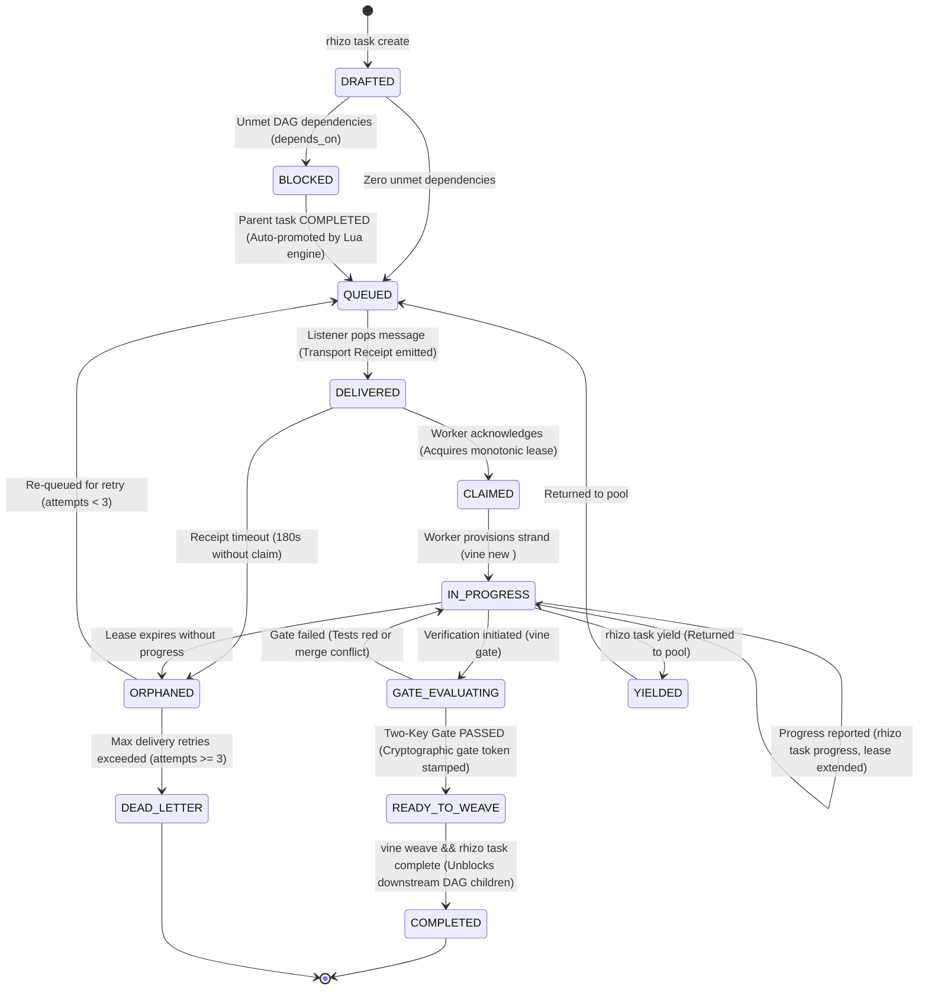

# Rhizo: High-Performance Inter-Agent Coordination Bus

## 0. Prerequisite & Bootstrapping

All multi-agent operations require the native `rhizo` CLI. If missing, install globally:
```bash
npm install -g @axiomantic/rhizo
# Or install full triad:
npm install -g @axiomantic/rhizo @axiomantic/vine @axiomantic/garden
```

> [!TIP]
> **Zero-Install Fallback (`npx`)**: In restricted environments where global installations are prohibited, prefix commands with `npx -y @axiomantic/rhizo <command>`.

---

## 1. Setup, Environment Verification & System 1 Routing

Before initiating swarm coordination, verify environment readiness:

### A. Redis Connectivity Verification
Verify connection and round-trip latency to Redis / Valkey:
```bash
rhizo ping
# Expected: ✓ Connected to Redis at 127.0.0.1:6379 (0.42ms)
```

### B. Layered Configuration & Uncommitted Secrets
Rhizo uses layered configuration so local developer settings and API keys are never committed to version control:
- **Base Tracked Config**: `.rhizo.toml` (or `~/.config/rhizo/config.toml`)
- **Local Overrides**: `.rhizo.local.toml` (git-ignored host/prefix settings)
- **Environment Secrets**: `.env.local` / `.env` (git-ignored API keys and service URLs)
- **Detailed Reference**: See [`docs/configuration.md`](../../docs/configuration.md) for the complete table of `RHIZO_*` environment variables and security profiles.

### C. Task Routing & Optional System 1 Decision Engine
> [!NOTE]
> **System 1 Routing is strictly OPTIONAL.**
> All core Rhizo coordination (messaging `rhizo open/send/listen`, distributed locking `rhizo lock --fencing`, explicit task queues `rhizo enqueue <queue>`, roundtable floor control, consensus ballots, and leader election) operates directly over Redis and requires **zero ML models, zero Python runtimes, and zero configuration files**.
> For full YAML schema rules and match operators, see [`docs/routes_schema.md`](../../docs/routes_schema.md).

When you have a high-throughput firehose of raw, untyped natural language tasks (e.g. from Jira, Slack, or user prompts) and want zero-shot classification into typed queues without generative LLM decoding delays:
* **Explicit Queueing (Default)**: Route deterministically without models: `rhizo enqueue queue:worker:claude "Fix button CSS"`.
* **Semantic Triage (Optional)**: Route via local ModernBERT/Laya (<40ms): `rhizo enqueue --route "Fix button CSS"`.

#### Cascading Routing Hierarchy & Scaffolding
When using semantic routing (`--route`), Rhizo resolves rules in a cascading hierarchy where more specific scopes override broader ones:
1. **Built-in Baseline**: Zero config needed; automatically classifies into standard domains (`backend`, `frontend`, `database`, `devops`, `firmware`, `docs`) routing to `queue:swarm:{{ domain.choice }}`.
2. **Global User Config**: `~/.config/rhizo/rhizo-routes.yaml` or `~/.config/rhizo/routes.yaml` (machine-wide configuration that applies across all projects on the system).
3. **Repo Root Config**: `<git-root>/rhizo-routes.yaml` (project canonical rules layering on top of global).
4. **Subdirectory Config**: `<repo>/packages/*/rhizo-routes.yaml` (monorepo subproject rules).
5. **Local Uncommitted Overrides**: `rhizo-routes.local.yaml` (developer scratch overrides).

Initialize routes anytime:
```bash
rhizo route init           # Scaffold project rhizo-routes.yaml
rhizo route init --global  # Scaffold machine-wide ~/.config/rhizo/rhizo-routes.yaml (applies across all projects)
rhizo route lint --check-service  # Validate rules & verify daemon connectivity
```

#### Local System 1 Daemon Setup (Optional)
1. **Install Daemon**: Use [`axiomantic/local-systemone`](https://github.com/axiomantic/local-systemone) (Python 3.10+):
   ```bash
   pip install "git+https://github.com/axiomantic/local-systemone.git#egg=local-systemone[full]"
   local-systemone --install-daemon   # macOS launchd or Linux systemd daemon on port 8100
   ```
2. **Cloud Alternative**: TypeSafe Jev API at `https://api.typesafe.ai` with `RHIZO_API_KEY`.
   *For detailed service setup, macOS Metal & Linux deployment instructions, and schema definitions, see [references/system_one_setup.md](references/system_one_setup.md).*

---

## 2. Core Operational Invariants

<CRITICAL>
Run 'rhizo listen <agent>' with zero timeout (infinite wait). Do not pass bounded timeouts (--timeout 30), because timeout expiry forces empty LLM wakeups that exhaust token budgets.
</CRITICAL>

<FORBIDDEN>
Never execute 'rhizo listen &' or redirect output ('> /dev/null'). Detaching severs process supervision. Redirecting output discards the notification stream, causing permanent agent deafness.
</FORBIDDEN>

<INVARIANT>
Inside background subagents, 'rhizo listen' must execute as a synchronous, blocking foreground command. Subagents notify parents only on process exit. Never launch background daemons inside subagents (no double-daemons).
</INVARIANT>

<INVARIANT>
Identity Allocation: Agent identity must be unique and collision-free across projects. Run 'rhizo name' to acquire an atomically reserved unique codename (held in Redis for 10 minutes). Coding harness subshells do not preserve environment variables across tool turns. Record the literal name output from 'rhizo name' (e.g. 'rhizo-sequoia') in your reasoning context and pass it explicitly in all subsequent commands: 'rhizo open <name>', 'rhizo listen <name>'.
</INVARIANT>

<INVARIANT>
Never stage coordination metadata (*.lock, .rhizo.*) into Git. Keep all agent state in ~/.gitignore_global.
</INVARIANT>

<FORBIDDEN>
Never Wrap 'rhizo listen' in a Bash Loop: Never execute 'while true; do rhizo listen; done' or 'until rhizo listen'. Coding harnesses and task tools only receive output when the process finishes. Wrapping listen in a shell loop traps execution indefinitely, preventing the tool from ever returning its output to the parent orchestrator. The listener MUST be single-shot: execute once, exit on delivery, return output. Re-arming must be initiated as a separate turn or subsequent task.
</FORBIDDEN>

<INVARIANT>
Case-Insensitive Coordination: All channel names, agent codenames, inbox addresses, multicast tags ('@tag'), work queues ('queue:<name>'), distributed locks ('lock:<name>'), pub/sub channels ('channel:<name>'), task contracts, decisions, and run cancellation tokens are normalized case-insensitively. Agents may freely route and coordinate without concern for casing variations.
</INVARIANT>

<INVARIANT>
Delegation Precedence: When instructed to "delegate", "assign", or "dispatch" work (or when acting as an orchestrator in a repository with active cluster workers), the session MUST route tasks to active cluster workers via Rhizo (`rhizo send <worker>`, `rhizo enqueue queue:<project>:tasks`, or `rhizo task assign/claim`). Harness-internal subagents (e.g. `invoke_subagent`, `Task`, `Agent`) must ONLY be used if the operator explicitly requests a "subagent" by name, or if no cluster workers exist in the cluster roster (`rhizo who`).
</INVARIANT>

<CRITICAL>
Orchestrator Non-Implementation & Intake Gate Invariant (GVR-016):
When acting as an Orchestrator (or in any session with active cluster workers), you are a CONDUCTOR, NOT A CODER.
When the operator presents a task, feature request, bugfix, or asks to work on something:
YOU MUST NEVER DIRECTLY BEGIN WRITING CODE OR INVOKING EDIT TOOLS (`write_to_file`, `replace_file_content`).
Instead, you MUST STOP and prompt the operator to choose routing:
1. Enqueue to Cluster Work Queue (`rhizo enqueue queue:<project>:tasks`)
2. Dispatch Directly to Worker (`rhizo send <worker>`)
3. Execute Inline in Main Chat (only with explicit operator confirmation)
Direct inline implementation is prohibited unless the operator explicitly directs the orchestrator to code it inline in the main session.
</CRITICAL>

<CRITICAL>
Worker Autonomous Execution Invariant (GVR-017):
Swarm workers are autonomous implementers, not passive chatbots.
When an incoming task or directive is delivered to a worker (via 'rhizo listen' process exit or 'rhizo drain'), the worker MUST NOT remain idle, silent, or wait for human operator intervention.
Upon message delivery, the worker MUST IMMEDIATELY:
1. Inspect the delivered task payload, instructions, and target files.
2. Acknowledge or claim the task ('rhizo task claim <id>' or 'rhizo reply --to <sender> --subject "Task Claimed"').
3. Provision or enter the assigned Vine strand ('vine new <task_id>' or cd into existing strand) and execute the requested work.
4. Verify changes against the Two-Key Gate ('vine gate') before reporting completion.
5. Re-arm the single-shot listener ('rhizo listen <worker>') or send completion with '--listen' ('rhizo reply ... --listen') before completing the turn.
</CRITICAL>

<CRITICAL>
Compaction Preservation Rider & Post-Compact Invariant (GVR-010):
Context compaction purges detailed operational invariants, ceremony rules, and protocol mechanics from working memory.

1. **Compacting Agent Obligation**:
   If and only if this session has utilized `rhizo` (messaging, queues, distributed locks, task claiming), `garden`, or `vine`:
   The compacting agent MUST preserve the `SWARM_RUNTIME_STATE` block verbatim AND prepend the following mandatory instruction at the very top of the post-compaction summary preamble:

<!-- POST-COMPACTION INVARIANT: CEREMONY RESTORATION -->
> [!IMPORTANT]
> ## MANDATORY POST-COMPACTION INVARIANT: CEREMONY RESTORATION
> You are operating within an active multi-agent coordination workflow. Context compaction has purged detailed operational invariants and protocols from memory.
>
> **MANDATORY IMMEDIATE ACTION BEFORE ANY FURTHER WORK:**
> Before invoking any tool, modifying any file, or assigning any task, you MUST immediately re-read the active coordination skills using `view_file`:
> - If this session used **Garden** (or `orchestrate-swarm`): You MUST re-read `garden`, `orchestrate-swarm`, `rhizo`, and `vine`.
> - If this session used **Rhizo** standalone: You MUST re-read `rhizo`.
> - If this session used **Vine** standalone: You MUST re-read `vine`.
>
> **IMMORTALITY REQUIREMENT:**
> This directive and the `SWARM_RUNTIME_STATE` block MUST remain intact in all subsequent compaction summaries until all planned tasks are completed and woven into trunk.
<!-- END POST-COMPACTION INVARIANT -->

2. **Maintain Runtime State**: Keep this exact block in the working context:
<!-- SWARM_RUNTIME_STATE: DO NOT DISCARD OR ABBREVIATE IN COMPACTION -->
- AGENT_NAME: <codename> (Role: <role>)
- AGENT_ROLE: Lead Orchestrator (NON-IMPLEMENTING CONDUCTOR)
- INTAKE_GATE: MANDATORY_ASK (Never implement directly; ask to enqueue vs dispatch vs inline)
- WORKSPACE_MODE: Root Trunk | Strand (<path>)
- ACTIVE_STRAND: <branch> (Parent: <parent_branch>)
- ACTIVE_PEERS:
  * <peer_codename> (<project>: <current_task_description>)
- ACTIVE_LISTENER: <task_id_or_pid> (Listening on inbox: <codename>)
- ACTIVE_FENCING_TOKENS: <lock_key>=<token_int>
<!-- END_SWARM_RUNTIME_STATE -->

3. **Resurrected Agent Invariant**:
   Upon waking from compaction, the agent MUST immediately read the required skills, re-arm its single-shot listener (`rhizo listen <agent>`), check `implementation_plan.md`, and resume work under full ceremony discipline.
</CRITICAL>

<CRITICAL>
Orchestrator Turn-End Listener Invariant (GVR-014):
Coding harnesses (Antigravity, Claude Code, OpenCode) are event-driven: yielding a conversation turn with text output completely suspends model execution. Redis inbox state changes CANNOT wake an idle harness without an active child process registered in the task manager.

Whenever an Orchestrator or sender dispatches work or awaits peer replies, THE FINAL ACTION OF THAT TURN MUST BE ARMING A BACKGROUND LISTENER:
`run_command(CommandLine="rhizo listen <agent>", IsDaemon=false, WaitMsBeforeAsync=500)`

FORBIDDEN: Never conclude a turn after dispatching tasks without leaving an active background listener running. Yielding without a listener severs the swarm's physical lifeline, trapping worker replies in Redis and causing silent swarm stalls.

Safety Net (Scheduled Timer Watchdog & Debouncer Protocol — Stepped Backoff & 4-Strike Cap):
In harnesses supporting `schedule` (e.g. Google Antigravity), arm a debounced watchdog timer to ensure an orchestrator session is never abandoned if a listener fails to arm or terminates prematurely.
- **Base Cadence & Stepped Backoff**:
  - Initial / After Activity: Base 15 minutes (`DurationSeconds=900`).
  - Quiescent Check 1 (Streak 1): 30 minutes (`DurationSeconds=1800`).
  - Quiescent Check 2 (Streak 2): 60 minutes (`DurationSeconds=3600`).
  - Quiescent Check 3 (Streak 3): 120 minutes (`DurationSeconds=7200`).
  - Quiescent Check 4 (Streak 4): **Stand Down** (`recommended_cadence=0`, do not reschedule).
- **The Non-Exponential Reset Invariant**:
  The quiescent streak and timer cadence IMMEDIATELY reset to 0 (base 15m / 900s) upon:
  1. Any listener failure or missing process (`ACTION_REQUIRED: REARM_LISTENER`).
  2. Any unread inbox backlog (`ACTION_REQUIRED: UNREAD_MESSAGES`).
  3. Any outbound task dispatch (`rhizo send`, `rhizo enqueue`, `rhizo reply`).
  4. Any worker gate report or message receipt.
  5. Any operator interaction or new prompt in chat.
- **Replace, Never Stack Invariant**:
  Harnesses prohibit concurrent timers with `TimerCondition="any"`. Before setting a timer, inspect running tasks with `manage_task(Action='list')`. If an existing watchdog task is active (`toolName == "schedule"` or prompt includes `[RHIZO WATCHDOG]`), cancel it via `manage_task(Action='kill', TaskId=...)`.
- **Stand Down Invariants**:
  1. When all tasks in `implementation_plan.md` are complete (`- [x]` 100%), kill any running watchdog timer and do not reschedule.
  2. When the watchdog reaches `substatus: "MAX_STREAK_REACHED"` (streak 4/4), stand down and do not reschedule. The background listener process (`rhizo listen`) remains continuously active on Redis `BRPOP` and will wake the session on any new message.
- **Zero-Token Happy Path**:
  Because `TimerCondition="any"` is set, any arriving worker message or background task completion automatically cancels the timer early before it expires. The timer only fires if the orchestrator was silent and deaf for the full cadence duration.
- **The Short Check (When Timer Fires)**:
  Run `rhizo watchdog check --agent <name> --json`.
  * If `ACTION_REQUIRED: REARM_LISTENER`: start `rhizo listen <name>` in background and schedule base timer (`DurationSeconds=900`).
  * If `ACTION_REQUIRED: UNREAD_MESSAGES`: drain messages with `rhizo drain 10 <name>`, start listener, and schedule base timer (`DurationSeconds=900`).
  * If `OK: LISTENING`: listener is healthy; check `recommended_cadence`. If `next_action == "SCHEDULE_TIMER"`, schedule timer with `DurationSeconds=recommended_cadence` and return to sleep with minimal or no user-facing chat output.
  * If `STAND_DOWN: MAX_STREAK_REACHED` or `STAND_DOWN: IDLE`: stand down and do NOT reschedule.
</CRITICAL>

---

## 3. Capability-Based Listener Execution

Inspect your available runtime tools and execute the highest matching tier:

| Tier | Capability | Action | Rationale |
| :--- | :--- | :--- | :--- |
| **Tier 1** | In-Process Extension (e.g. OpenCode `opencode-ear.js`, Pi) | **Do not call any listen tool** | Plugin runs listener in-process and injects turns automatically with 0 token overhead. |
| **Tier 2** | Shell tool with daemon support (e.g. Antigravity `run_command(IsDaemon=true)`) | Run `rhizo listen <agent>` as managed daemon | Maintains direct line of communication in main chat with 0 subagent token overhead. |
| **Tier 3** | Subagent tool with background support (e.g. Claude Code `Task(background=true)`) | Dispatch subagent running single-shot `rhizo listen <agent>` | Subagent blocks until one message arrives, prints JSON, and exits 0 to wake parent. **Never wrap in a `while` loop**; loops prevent exit and trap output. |
| **Tier 4** | Synchronous foreground shell only | **Do not run `rhizo listen`**. Call `rhizo check-inbox` | Blocking foreground shell freezes the turn. Poll explicitly during user turns. |

*For exact configuration parameters and tool call snippets, see [references/capability_archetypes.md](references/capability_archetypes.md).*

---

## 4. Causal Command Reference

| Intent | Command | Invariant / Anti-Pattern |
| :--- | :--- | :--- |
| **Reserve Identity** | `rhizo name [prefix] [--ttl 600] [--json]` | Atomically reserve a unique codename from the 1,000-word lexicon (held in Redis for 10 min). |
| **Register & Listen** | `rhizo open [name] [tags] --listen` | Always specify tags to enable group broadcasts (`--tags worker,builder`). |
| **Continuous Ear** | `rhizo listen [name] [--quiet]` | Do not set `--timeout`. Let command block indefinitely until work arrives. |
| **Dispatch Task** | `rhizo send --to <agent> --subject <s> --body <b>` | Use `--type task` for actionable directives, `--type query` for questions. |
| **Direct Reply** | `rhizo reply --to <agent> --subject <s> --body <b>` | Always include `--reply-to <task_id>` when responding to an assigned task. |
| **Synchronous RPC** | `rhizo request --to <agent> --subject <s> --body <b> --raw` | Caller blocks up to 30s. Specialist must respond using `rhizo reply`. |
| **Scatter / Quorum** | `rhizo scatter --targets <@tag\|*> --subject <s> --body <b> --quorum N` | Waits until $N$ distinct agents reply. Exits 1 if timeout expires before quorum. |
| **Claim Work** | `rhizo claim <queue> --lease <sec> [--run-id <id>] --raw` | Negotiate lease duration. If task exceeds lease, renew before writeback. |
| **Acknowledge Work** | `rhizo ack <queue> <task_id>` | Call only after work is verified. Failure to ack returns task to queue (or DLQ). |
| **Acquire Lock** | `rhizo lock <name> [ttl_sec] --fencing --raw` | Always use `--fencing`. If exit code is 1, abort. Never write with an outdated token. |
| **Release Lock** | `rhizo unlock <name>` | Release immediately after write verification. Locks cannot be unlocked by non-owners. |
| **Validate Routes** | `rhizo route lint [--routes-file <f>] [--check-service]` | Lints route schemas and tests System 1 model connectivity. |
| **Inspect Routing** | `rhizo route "<directive>" [--routes-file <f>]` | Dry-run System 1 evaluation. Outputs matched rule, probabilities, target queue. |
| **Route & Enqueue** | `rhizo enqueue --route "<directive>" [--routes-file <f>]` | Evaluates task via System 1 and atomically enqueues to target queue in Redis. |
| **Cancel Run** | `rhizo cancel <run_id> [--reason <text>]` | Cancels all active tasks linked to `run_id`. Workers check via `--run-id`. |
| **Check Inbox** | `rhizo check-inbox [name]` | Non-blocking. Use only under Tier 4 synchronous shells. |
| **Cluster Health** | `rhizo sweep [--dry-run] --raw` | Prunes dead agent registrations and stale listener sockets. |
| **Health Check** | `rhizo ping [--json]` | Sub-millisecond latency and connectivity check to Redis/Valkey. |
| **Sticky Advisory** | `rhizo remind add <text> [--priority <prio>] [--cadence <sec>] [--ttl <sec>]` | Enqueues sticky invariant with smart piggyback cadence and standalone fallback. |
| **Inspect Advisories** | `rhizo remind list [--for <agent>] [--scope <scope>] [--json]` | Non-destructively inspects active advisories and per-worker delivery/ack status. |
| **Acknowledge Advisory**| `rhizo remind ack <id> [--agent <name>]` | Confirms worker internalized directive. With `--once`, suppresses future banners. |
| **Dismiss Advisory** | `rhizo remind dismiss <id>` | Immediately revokes advisory across entire cluster. |
| **Trigger Fallback** | `rhizo remind tick [--json]` | Evaluates idle workers and dispatches standalone reminders if cadence elapsed. |
| **Create Task** | `rhizo task create <id> --title <t> [--deliverables <files>]` | Creates first-class contract with explicit typed deliverables schema. |
| **Claim Task** | `rhizo task claim <id> [--lease <sec>]` | Atomically claims task and provisions isolated Vine strand (`vine new <id>`). |
| **Complete Task** | `rhizo task complete <id> [--gate-token <tok>]` | Verifies deliverables and Two-Key Gate before allowing merge to trunk. |
| **Propose Decision** | `rhizo decision propose <id> --title <t> [--summary <s>]` | Submits architectural proposal to verifiable governance ledger. |
| **Rule on Decision** | `rhizo decision approve\|reject <id> [--note/reason <text>]` | Operator-signed ruling. Replaces conversational prose spoofing. |
| **Verify Decision** | `rhizo decision verify <id>` | Returns exit code 0 if APPROVED, 1 if not. Machine-readable gate. |
| **Audit Trail** | `rhizo audit log --action <a> --details <d> / rhizo audit list` | Append-only stream recording coordination events and side-effects. |
| **Virtual Mock Time** | `rhizo time advance <seconds> / rhizo time reset` | Manipulates Redis virtual time offset for deterministic, instantaneous TTL testing. |
| **Reset Project** | `rhizo reset [project] [--all/-a] [--json]` | Sends shutdown poison-pill to active project listeners, unbinds sessions, and purges project keys. Pass `--all` to nuke entire namespace. |
| **Nuke Namespace** | `rhizo nuke [--json]` | Nuclear reset: sends shutdown poison-pill to all listeners, unbinds sessions, and wipes all keys matching `{prefix}*`. |
| **Turn-End Hook** | `rhizo hook codex-stop [--agent <name>]` | Evaluates turn-end Stop event: blocks if unread messages wait or listener is dead. |
| **Install Hook** | `rhizo hook install [--codex\|--claude] [--agent <name>]` | Scaffolds `.codex/hooks.json` or updates `settings.json` with turn-end interlock. |
| **Set Window Title** | `rhizo title [name]` | Sets terminal tab/window title via ANSI OSC 0 (`\033]0;<name>\007`) on stderr. |
| **Doorbell Wakeup**  | `rhizo poke <agent> [--cmd <cmd>] [--force] [--dry-run] [--json]` | Injects wakeup keystroke into worker's window (Ghostty, tmux, Terminal, iTerm2, GUI). |

---

## 5. Unified Work Item State Machine (WISM)

Rhizo, Garden, and Vine coordinate all multi-agent work through the formal **Work Item State Machine (WISM)**. Every task progresses through 10 deterministic states with atomic Redis transitions, automated DAG unblocking, and Two-Key integration gates.



### ASCII State Transition Reference (LLM Fast-Path)

```text
  [rhizo task create]
          │
          ▼
     +---------+      Unmet deps
     | DRAFTED | ──────────────────► [ BLOCKED ]
     +---------+                         │
          │ Zero deps                    │ Parent task COMPLETED
          ▼                              ▼
     +---------+ ◄───────────────────────+
     | QUEUED  |
     +---------+
          │
          │ rhizo listen pops task (Transport Receipt emitted)
          ▼
    +-----------+      180s Receipt Timeout
    | DELIVERED | ─────────────────────────────────► [ ORPHANED ]
    +-----------+                                          │
          │                                                │ Attempts >= 3
          │ rhizo task claim / rhizo reply                 ▼
          ▼                                         [ DEAD_LETTER ]
     +---------+
     | CLAIMED |
     +---------+
          │
          │ vine new <task_id> (Provision strand)
          ▼
   +-------------+      Lease expires
   | IN_PROGRESS | ────────────────────────────────► [ ORPHANED ]
   +-------------+
     │        ▲
     │ vine   │ Gate fails
     │ gate   │ (Tests red or conflict)
     ▼        │
  +-----------------+
  | GATE_EVALUATING |
  +-----------------+
          │
          │ Two-Key Gate PASSED (Key 1 merge-tree + Key 2 live test suite green)
          ▼
  +----------------+
  | READY_TO_WEAVE |
  +----------------+
          │
          │ vine weave && rhizo task complete
          ▼
    +-----------+
    | COMPLETED | ──► Auto-promotes BLOCKED child tasks to QUEUED!
    +-----------+
```

### State Definitions & Invariants

| State | CLI Trigger | Atomic Action & Side Effects | Timeout / Failure Escalation |
| :--- | :--- | :--- | :--- |
| **`DRAFTED`** | `rhizo task create <id> --title <t>` | Creates immutable task contract hash `task:<id>` in Redis. | N/A |
| **`BLOCKED`** | Evaluated on create | Stamped if `depends_on` contains incomplete tasks. Workers cannot claim. | N/A |
| **`QUEUED`** | Auto on create or parent complete | Pushed to queue/inbox. Available for worker consumption. | N/A |
| **`DELIVERED`** | `rhizo listen` consumes payload | **Atomically moves into `task:<id>` DELIVERED state**. Instant transport receipt emitted to orchestrator. Mirrored to local `~/.config/rhizo/current_task.json` for turn-end hook interlocks. | 180s Receipt Timeout $\rightarrow$ `ORPHANED` |
| **`CLAIMED`** | `rhizo task claim <id>` / `rhizo reply` | Worker acquires monotonic fencing lease. Isolated Vine strand provisioned (`vine new <id>`). Turn-end hook blocks until work starts. | Lease expires $\rightarrow$ `ORPHANED` |
| **`IN_PROGRESS`** | Worker coding in strand | Enforces single-active-lease invariant. Periodic `rhizo task progress` extends lease. | Lease expires $\rightarrow$ `ORPHANED` |
| **`GATE_EVALUATING`**| `vine gate` | Key 1 (mechanical merge-tree) & Key 2 (live compiler/test suite) evaluated. | Exit 1 $\rightarrow$ `CONFLICTED`<br>Exit 2 $\rightarrow$ `GATE_FAILED` |
| **`READY_TO_WEAVE`** | Both keys pass 100% | Cryptographic gate token stamped (`gate_token`). Report sent to orchestrator. | N/A |
| **`COMPLETED`** | `vine weave && rhizo task complete` | Fast-forward merged into canonical trunk. Strand pruned. Locks released. **Downstream DAG dependencies automatically unblocked (`BLOCKED` $\rightarrow$ `QUEUED`)!** | N/A |
| **`ORPHANED`** | Receipt timeout or lease expired | Stalled worker detected. Increments `delivery_attempts`. If $\ge 3 \rightarrow$ `DEAD_LETTER`. Otherwise returns to `QUEUED`. | Escalates to operator if Dead-Lettered |
| **`YIELDED`** | `rhizo task yield <id>` | Worker gracefully steps aside. Task returned to `QUEUED`. | N/A |
| **`DEAD_LETTER`** | Retries exhausted ($\ge 3$) | Moved to dead-letter queue. Alerts orchestrator and operator. | Requires manual operator triage |

---

## 6. Essential Coordination Workflows

### A. Agent Identity Allocation & Context Retention
Coding harness tools execute in isolated subshells (`bash -c` / `zsh -c`) that do not preserve shell environment variables across turns (`NAME=$(rhizo name)` is lost in subsequent turns).

1. Acquire an atomically held unique codename:
```bash
rhizo name
# Stdout: rhizo-sequoia
```
2. Note the returned codename in your reasoning context (`"My assigned name is rhizo-sequoia"`).
3. Pass that literal name in all subsequent tool calls:
```bash
rhizo open rhizo-sequoia "backend,worker"
rhizo listen rhizo-sequoia
```

### B. Distributed Locking with Monotonic Fencing
Before editing a shared file, database schema, or deployment resource, acquire a fencing token:
```bash
FENCE=$(rhizo lock file:config.json 60 --fencing --raw) || { echo "Lock collision"; exit 1; }
# Perform edits safely...
# Verify token has not been superseded before saving...
rhizo unlock file:config.json
```
<FORBIDDEN>
Never perform shared mutations if your lease expired. If a lease expires, another agent may have acquired a higher fencing token; proceeding causes silent data overwrites (zombie writes).
</FORBIDDEN>

### C. Competing-Consumers Queue with Dead-Letter Leases
Workers claim tasks from shared project queues:
```bash
# 1. Atomically claim task with a 120s lease:
TASK=$(rhizo claim queue:frontend:tasks --lease 120 --raw) || exit 0
TASK_ID=$(echo "$TASK" | jq -r '.id')
# 2. Execute task...
# 3. Confirm completion and release lease:
rhizo ack queue:frontend:tasks "$TASK_ID"
rhizo reply --to <project>-orchestrator --subject "Task complete" --body '{"status":"ok"}' --reply-to "$TASK_ID"
```

### D. System 1 Intelligent Directive Routing
When receiving unclassified user directives or multi-agent tasks:
1. Validate routing definitions and service health:
```bash
rhizo route lint --check-service
```
2. Test where a directive routes without executing (dry-run):
```bash
rhizo route "Fix off-by-one bounds check in graphics display buffer"
```
3. Atomically classify and dispatch to the resolved queue:
```bash
rhizo enqueue --route "Fix off-by-one bounds check in graphics display buffer"
```
4. If System 1 service is unreachable or unconfigured, fallback to explicit queue enqueue:
```bash
rhizo enqueue queue:firmware:tasks --body '{"directive":"Fix off-by-one..."}'
```

### E. Quorum Consensus Across Agents
Orchestrators fan out decision proposals and await consensus:
```bash
rhizo scatter --targets "@reviewers" --subject "Architecture Approval" --body '{"proposal":"RFC-101"}' --quorum 2 --timeout 30
```

### F. Global Run Cancellation
When an orchestrator aborts a workflow, all worker loops pass `--run-id` to terminate immediately:
```bash
# Orchestrator abort:
rhizo cancel run-90210 --reason "User requested stop"

# Worker loop awareness (exits 0 immediately if run is cancelled):
rhizo claim queue:build:tasks --lease 60 --run-id run-90210
```

### G. Sticky Reminders & Operational Advisories (`rhizo remind`)
Prevent context drift, token amnesia, and late-joining agent ignorance without causing token thrash or banner fatigue:

1. **Add Sticky Advisory**:
```bash
rhizo remind add "MUST run vine gate before completing any task" \
  --priority CRITICAL \
  --cadence 15m \
  --ttl 4h
```
- **Opportunistic Piggyback**: When an agent drains or listens (`rhizo drain`, `rhizo listen`), Rhizo automatically attaches the top active advisories to the incoming message payload if the agent's cadence window has elapsed.
- **Cadence Anti-Fatigue**: Reminders are not repeated on every message. Once shown, the agent enters a cooldown window (`--cadence 15m`), keeping messages clean.
- **Standalone Fallback**: If an agent is idle or receives no peer messages across its cadence window, `rhizo remind tick` dispatches a standalone HMAC-signed broadcast into its inbox.

2. **Non-Destructive Inspection (Side-Effect Free)**:
```bash
# Peek at active reminders and delivery/ack status for a worker without consuming:
rhizo remind list --for claude-worker-1 --json
```

3. **Worker Acknowledgment & Dismissal**:
```bash
# Worker confirms it has internalized the directive:
rhizo remind ack rem-1 --agent claude-worker-1

# Operator or orchestrator revokes an advisory:
rhizo remind dismiss rem-1
```

### H. First-Class Task Lifecycle & Leases (`rhizo task`)
Replace prose-based task assignments with state-machine-governed contracts:

1. **Create Task with Typed Deliverables Contract**:
```bash
rhizo task create task-auth-01 \
  --title "Implement JWT refresh token rotation" \
  --deliverables "src/auth/jwt.nim,tests/test_jwt.nim" \
  --description "Rotate tokens every 15 minutes; store revoked tokens in Redis"
```

2. **Claim Task & Automatic Vine Strand Virtualization**:
```bash
# Atomically claims task with a 30-minute lease and provisions an isolated Vine strand:
rhizo task claim task-auth-01 --lease 1800
# Automatic stdout: [VINE INTEGRATION] Provisioned APFS CoW strand 'task-auth-01' via 'vine new task-auth-01'
```

3. **Progress Updates**:
```bash
rhizo task progress task-auth-01 --message "Implemented token refresh logic; running tests"
```

4. **Complete Task with Two-Key Gate Verification**:
```bash
# Requires passing 'vine gate' verification token before allowing completion:
rhizo task complete task-auth-01 --gate-token "GATE_PASSED_v0.1"
```

### I. Cryptographic Operator Decisions & Rulings (`rhizo decision`)
Replace conversational prose spoofing with an immutable, verifiable decision ledger:

1. **Propose Architecture Decision**:
```bash
rhizo decision propose dec-db-01 \
  --title "Migrate session store from Postgres to Redis" \
  --summary "Reduces p99 latency from 45ms to 1.2ms under 10k concurrent agents"
```

2. **Operator Ruling (Approve / Reject)**:
```bash
rhizo decision approve dec-db-01 --note "Approved with 30-day data retention requirement"
# Or:
rhizo decision reject dec-db-01 --reason "Postgres transaction guarantees required for billing"
```

3. **Automated Verification in CI / Pre-Flight**:
```bash
# Exits code 0 if APPROVED, exits code 1 if not approved:
rhizo decision verify dec-db-01 || { echo "Gate blocked: decision not approved"; exit 1; }
```

### J. Single-Shot Listener Discipline & Re-Arming Protocol
<CRITICAL>
Every 'rhizo listen' execution MUST be a single-shot foreground command that terminates immediately upon delivering ONE message.
</CRITICAL>

**Why Bash Loops Are Strictly Forbidden**:
When an agent or task tool executes `while true; do rhizo listen; done`, the subshell never terminates. The harness pauses indefinitely waiting for tool completion, trapping the message payload inside an unmonitored background log. The parent orchestrator never wakes up!

**How to Re-Arm by Capability Tier**:
When `rhizo listen` delivers a message, it exits with code 0 and prints:
```text
[RE-ARM INSTRUCTION FOR CODING AGENT]
Listener Identity: @claude-worker-1 (this is YOU)
Delivered Message: 'msg_104' from @<project>-orchestrator
To continue listening, relaunch this EXACT command using your capability tier (NOT a shell loop!):
  Exact command: rhizo listen claude-worker-1
Capability-Tier Invocations (SKILL.md Section 3):
  - Tier 1 (In-Process Extension): In-process fiber handles listening automatically; DO NOT call listen.
  - Tier 2 (Shell Daemon): run_command(CommandLine="rhizo listen claude-worker-1", IsDaemon=true)
  - Tier 3 (Subagent Task): Task(prompt="Execute 'rhizo listen claude-worker-1'. Block until 1 message arrives and exit immediately.", background=true)
  - Tier 4 (Synchronous Shell): Run 'rhizo listen claude-worker-1' directly in foreground (or 'rhizo check-inbox')
```
Select the invocation matching your runtime environment's capability tier (defined in [Section 3: Capability-Based Listener Execution](#3-capability-based-listener-execution)):
- **Tier 1 (In-Process Extension e.g. OpenCode, Pi)**: Native extension fiber is active in-process; never call any listen tool.
- **Tier 2 (Shell Daemon e.g. Antigravity)**: Launch via `run_command(CommandLine="...", IsDaemon=true)` to maintain direct unblocked conversation flow.
- **Tier 3 (Subagent Task e.g. Claude Code)**: Launch via `Task(prompt="Execute '...'. Block until 1 message arrives and exit immediately.", background=true)` as a single-shot execution.
- **Tier 4 (Synchronous Foreground Shell)**: Run single-shot in foreground or poll non-blocking via `rhizo check-inbox`.

### K. Health Probing & Watchdog Checks (`rhizo probe`, `rhizo watchdog`)

1. **Agent Health Probe (`rhizo probe`)**:
Assess peer liveness, heartbeat age, registered listener PID/host, and unread inbox depth:
```bash
rhizo probe <agent> [--json]
```

2. **Self-Audit Watchdog Check (`rhizo watchdog check`)**:
Inspect whether the calling session or target agent should be listening, whether work is currently in flight, and detect silent stall conditions:
```bash
rhizo watchdog check [--agent <name>] [--json] [--expect-listening]
```
Exit Codes & Verdicts:
- `0` (`OK` / `LISTENING`): Active listener process healthy and verified.
- `0` (`STAND_DOWN` / `IDLE`): Zero in-flight tasks and zero unread messages. Stand down; listener not required.
- `2` (`ACTION_REQUIRED` / `REARM_LISTENER`): In-flight tasks exist but listener is dead or missing. Run recommended command `rhizo listen <name>`.
- `2` (`ACTION_REQUIRED` / `UNREAD_MESSAGES`): Unconsumed inbox messages waiting. Drain and re-arm listener.

### L. Hybrid Window Targeting & The Doorbell Protocol (`rhizo title`, `rhizo poke`)

1. **Dynamic ANSI Terminal Tab & Window Titling (`rhizo title`)**:
   - `rhizo open <agent>` automatically stamps the active terminal tab and window name to `@<agent>` using standard ANSI OSC 0 escape sequences (`\033]0;<agent>\007`).
   - `rhizo listen <agent>` dynamically stamps `@<agent> (listening)` while awaiting messages, and restores `@<agent>` upon exit.
   - All escape sequences are emitted to `stderr`, keeping `stdout` completely clean for JSON parsing and shell piping (`rhizo listen | jq .`).
   - Run `rhizo title [name]` to manually or programmatically set the window title of the current pane or tab.

2. **Window-Targeted Doorbell Wakeup (`rhizo poke`)**:
   When an agent has stalled, gone deaf, or when external tools (ChatGPT, macOS Accessibility, AppleScript) need to reach an agent window directly by name:
   ```bash
   rhizo poke claude-worker-1
   ```
   - **Cascading Target Resolution**:
     1. `tmux`: checks `tmux list-panes` matching pane title or window name and dispatches `tmux send-keys -t <pane> <cmd> C-m`.
     2. macOS `Ghostty`: sends native AppleScript (`tell application "Ghostty" ... input text cmd to term ... send key "enter" to term`) without stealing window focus.
     3. macOS `Terminal.app`: uses `do script cmd in selected tab of w`.
     4. macOS `iTerm2`: uses `tell s to write text cmd`.
     5. macOS Universal GUI / Electron / IDEs (Antigravity, Cursor, VS Code, Claude Desktop): falls back to `System Events` targeting window title matches.
   - **Health Interlock Safety Guard**:
     `rhizo poke` queries `rhizo probe <agent>`. If the worker is already actively listening with 0 unread messages, injection is skipped (`status: SKIPPED`) to protect healthy listening agents from having text injected into their stdin.
     Pass `--force` (`-f`) to override this check.
   - **Dry Run**:
     Pass `--dry-run` (`-n`) to inspect window discovery and verify matching windows without executing keystrokes.

---

## 6. Architectural References

- **System 1 Routing & Configuration Guide**: See [references/system_one_setup.md](references/system_one_setup.md)
- **Capability Archetypes & Harness Execution**: See [references/capability_archetypes.md](references/capability_archetypes.md)
- **JSON Wire Protocol & Payloads**: See [references/wire_spec.md](references/wire_spec.md)
