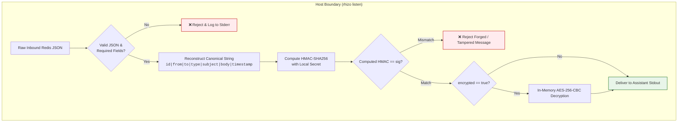

# Rhizo Wire Protocol & Schema Specification

This document provides the formal reference specification for messages transmitted across the Redis Rhizo inter-assistant bus.

---

## 1. Envelope Schema (JSON)

Every message stored in an agent inbox (`${RHIZO_REDIS_PREFIX}inbox:<recipient>`) must be a valid JSON object matching this schema:

```json
{
  "id": "msg_1789777056_alice_83728",
  "from": "alice",
  "to": "bob",
  "type": "task",
  "reply_to": null,
  "tags": ["rhizo", "ticket-104"],
  "subject": "Review auth parser changes",
  "body": "Please inspect src/auth.ts and verify if token expiry handles leap years.",
  "timestamp": "2026-09-19T00:17:36Z",
  "sig": "9f8a3c4b12...64hex",
  "encrypted": false
}
```

### Fields

| Field | Type | Required | Description |
| :--- | :--- | :--- | :--- |
| `id` | `string` | **Yes** | Unique message identifier. Recommended format: `msg_<unix_ts>_<sender>_<random>`. |
| `from` | `string` | **Yes** | Ephemeral identity name of the sending agent. |
| `to` | `string` | **Yes** | Direct recipient name (e.g. `bob`), multicast tag (e.g. `@rhizo,qa`), or global broadcast (`*`). |
| `type` | `string` | **Yes** | One of: `"task"`, `"query"`, `"reply"`, `"status"`. |
| `reply_to` | `string` \| `null` | **Yes** | ID of the previous message being replied to, or `null` if initiating a conversation. |
| `tags` | `array[string]` | **Yes** | Routing, project, or ticket tags. |
| `subject` | `string` | **Yes** | Brief human-readable summary of the payload. |
| `body` | `string` | **Yes** | Work instructions, question, or response payload (plaintext or AES ciphertext). Keep under 10KB. |
| `timestamp` | `string` | **Yes** | ISO-8601 UTC timestamp string (e.g. `YYYY-MM-DDTHH:MM:SSZ`). |
| `sig` | `string` \| `null` | **No** | HMAC-SHA256 hex signature authenticating message contents. |
| `encrypted` | `boolean` | **No** | Defaults to `false`. When `true`, `body` is AES-256-CBC ciphertext. |
| `reminders` | `array[object]` | **No** | Active sticky advisories piggybacked onto the message payload. |
| `elapsed_seconds` | `integer` | **No** | Computed message age in seconds relative to current (or virtual mock) time. |
| `age_human` | `string` | **No** | Human-readable relative age (e.g. `"14m"`, `"2h"`). |
| `is_stale` | `boolean` | **No** | Set to `true` if `elapsed_seconds >= 3600` (1 hour) to flag stale messages. |

---

## 2. Message Types & Communication Rules

1. **`task`**:
   - Contains an actionable request (e.g. run a test, inspect a file, implement a feature).
   - Expected response: Worker executes the work and replies unicast with `type: "reply"`.
2. **`query`**:
   - Informational question (e.g. "What branch are you on?", "Is ticket-42 ready?").
   - Expected response: Unicast answer with `type: "reply"`.
3. **`reply`**:
   - Must set `reply_to` matching the sender's original message `id`.
   - **Critical Invariant**: Replies must ALWAYS be sent directly to `from` (O2O). Never reply to group tags or `*`.
4. **`status`**:
   - Informational broadcast (e.g. "Session shutting down", "Build succeeded").
   - No reply expected.
5. **`reminder`**:
   - Standalone sticky advisory dispatched when an agent's cadence window elapses without peer traffic.
   - Contains `reminder_id` and `priority` fields. No reply expected.

---

## 3. Cryptographic Security & Prompt-Injection Firewall

Rhizo employs an out-of-band cryptographic security model to protect coding assistants from forged tasks, unauthorized cluster access, and prompt injection attacks:

### Secret Key Storage
- Secret key stored at `~/.config/rhizo/secret` (or `~/.config/locutus/secret`) with `0600` permissions (read/write by owner only).
- Auto-generated on first run with 256-bit cryptographically secure entropy (`openssl rand -hex 32`).
- The secret key **never enters the assistant's LLM context window**, is never passed as a prompt argument, and is never transmitted across Redis.

### HMAC-SHA256 Signature Verification
- Senders sign outgoing messages automatically using `rhizo send` or `rhizo broadcast`.
- Signature covers canonical concatenation: `id|from|to|type|subject|body|timestamp`.
- Receiving agents verify signatures automatically via `rhizo listen`.

### Prompt-Injection Firewall (Air-Gap Invariant)
- Forged, tampered, or unsigned messages are dropped **at the process boundary** by `rhizo listen` before entering stdout.
- Dropped messages are logged to stderr only (`[RHIZO SECURITY] WARNING: Dropping unauthenticated/tampered message`). The assistant never receives malicious or forged content into its context window, neutralizing prompt injection attacks before they can execute.



### Optional End-to-End Encryption (E2EE)
- Setting `RHIZO_ENCRYPT=1` (or `LOCUTUS_ENCRYPT=1`) encrypts the `body` using AES-256-CBC PBKDF2.
- Plaintext payload never touches the Redis keyspace.
- `rhizo listen` automatically detects `encrypted: true` and decrypts before delivering to the agent.

---

## 4. Pydantic Model Reference

```python
from datetime import datetime
from typing import List, Literal, Optional
from pydantic import BaseModel, ConfigDict, Field, field_validator


class RhizoMessage(BaseModel):
    model_config = ConfigDict(populate_by_name=True)

    id: str = Field(..., min_length=3, description="Unique message ID")
    from_agent: str = Field(..., alias="from", min_length=1, description="Sender agent name")
    to_agent: str = Field(..., alias="to", min_length=1, description="Recipient name, @tag, or *")
    type: Literal["task", "query", "reply", "status"] = Field(..., description="Message envelope type")
    reply_to: Optional[str] = Field(default=None, description="Original message ID for reply threading")
    tags: List[str] = Field(default_factory=list, description="Associated routing or ticket tags")
    subject: str = Field(..., min_length=1, description="Message subject line")
    body: str = Field(..., min_length=1, description="Task, query, or reply payload content")
    timestamp: str = Field(..., description="ISO-8601 timestamp string")
    sig: Optional[str] = Field(default=None, description="HMAC-SHA256 authentication signature")
    encrypted: bool = Field(default=False, description="True if body payload is AES-256-CBC encrypted")

    @field_validator("tags", mode="before")
    @classmethod
    def validate_tags(cls, v):
        if isinstance(v, dict):
            return list(v.keys())
        if isinstance(v, str):
            return [t.strip() for t in v.split(",") if t.strip()]
        return v or []

    @field_validator("timestamp")
    @classmethod
    def validate_iso_timestamp(cls, v: str) -> str:
        try:
            datetime.fromisoformat(v.replace("Z", "+00:00"))
        except Exception as e:
            raise ValueError(f"Field 'timestamp' must be a valid ISO-8601 format: {e}")
        return v


# Backwards compatibility aliases
LocutusMessage = RhizoMessage
A2AMessage = RhizoMessage
```

---

## 5. Advanced Coordination & Bus Primitives

Rhizo extends standard direct and broadcast messaging with five primitives for multi-agent workflows:

### 1. Synchronous RPC (`rhizo request`)
- **Key Pattern**: `${RHIZO_REDIS_PREFIX}inbox:reply:<request_id>`
- **Workflow**:
  1. Caller generates unique `req_id` and sets `reply_to: "reply:<req_id>"`.
  2. Caller dispatches task to recipient and immediately blocks on `BRPOP ${RHIZO_REDIS_PREFIX}inbox:reply:<req_id> <timeout>`.
  3. Recipient processes task and sends reply unicast to `reply:<req_id>`.
  4. Caller authenticates HMAC signature, decrypts if encrypted, and outputs result.

### 2. Competing-Consumers Work Queues (`rhizo enqueue` / `rhizo work`)
- **Key Pattern**: `${RHIZO_REDIS_PREFIX}queue:<queue_name>`
- **Workflow**:
  - Producers run `rhizo enqueue <queue_name> ...` which executes `LPUSH` + `EXPIRE`.
  - Any number of worker agents run `rhizo work <queue_name> [timeout]`.
  - Redis `BRPOP` atomically pops exactly one task to exactly one worker (competing-consumers pattern with zero race conditions).

### 3. Distributed Mutex / Lock (`rhizo lock` / `rhizo unlock`)
- **Key Pattern**: `${RHIZO_REDIS_PREFIX}lock:<lock_name>`
- **Workflow**:
  - `rhizo lock <name> [ttl] --fencing`: Atomically executes SET key owner NX EX ttl and returns monotonic fencing token.
  - `rhizo unlock <name>`: Atomically verifies current owner matches caller before deleting key via Lua.

### 4. Agent Operational State & Activity Tracking
- **Key Pattern**: `${RHIZO_REDIS_PREFIX}agent:<agent_name>` (Hash)
- **Fields**: `state` (`idle`, `busy`, `error`), `activity` (arbitrary descriptive text), `last_seen`.
- **Workflow**:
  - Agents announce status via `rhizo status <state> [activity]`.
  - Cluster peers view state and live activity in `rhizo who` output.

### 5. Ephemeral Pub/Sub Streaming (`rhizo pub` / `rhizo sub`)
- **Channel Pattern**: `${RHIZO_REDIS_PREFIX}channel:<channel_name>`
- **Workflow**:
  - `rhizo pub <channel> <message>`: Fires real-time Redis `PUBLISH` to active subscribers with zero queue storage overhead.
  - `rhizo sub <channel> [timeout]`: Listens for live broadcasts, exiting upon message receipt or timeout.


